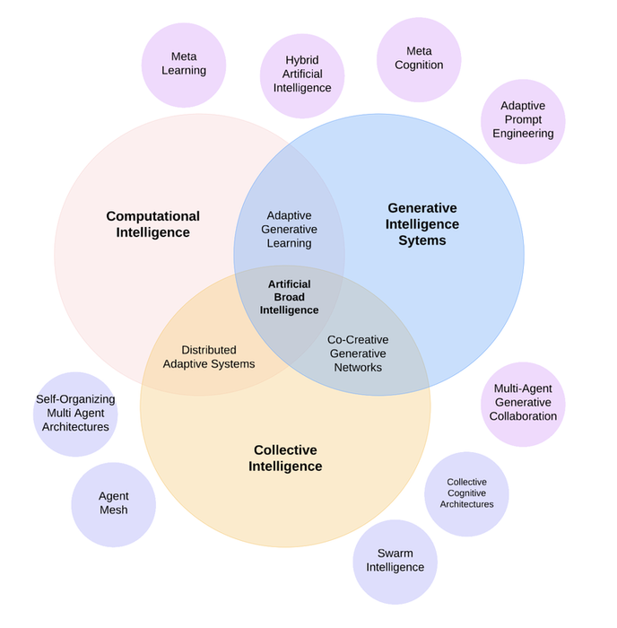

### [Home](./index.md) | [Projects](./projects.md) | [Publications](./knowledge.md#publications) | [Education](./knowledge.md) | [Team](./people.html) | [Collaborate](./collaborate.md)

The Generative Intelligence Lab promotes knowledge transfer through technical reports, scientific publications, education courses and tutorials around our topics of interest.

## Tutorials

We provide tutorials aimed at promoting knowledge sharing and advancing education in the field of Generative Intelligence. Our tutorials blend theory, practical insights, and real-world applications to equip the community with the tools to innovate and collaborate.

* [**TUTORIAL - Generative Intelligence in Academic Projects**](./pdfs/TUTORIAL%20Generative%20Intelligence%20in%20Academic%20Projects.pdf): introduces the core concepts, capabilities, and practical applications of Generative Intelligence in scientific research, with a special focus on multi-disciplinary projects. The session is designed for a **non-technical audience** and aims to promote an understanding of Generative AI as an enabler for new forms of interaction, collaboration, and creativity in research. 

* [**TUTORIAL - Generative Intelligence and Business**](./pdfs/TUTORIAL%20Generative%20Intelligence%20and%20Business%20.pdf): this tutorial demonstrate how Generative Intelligence Systems operate to reshape business processes, open new business opportunities, and augment or create innovative applications. It is designed for a **business audience with a non-technical background**, and promotes an understanding of Generative AI as a strategic enabler—helping organizations re-imagine interaction, support business missions, and unlock new value.

* [**TUTORIAL - Generative Intelligence and Software Development Lifecycles**](./pdfs/TUTORIAL%20Generative%20Intelligence%20and%20Software%20Development%20Lifecycles.pdf): examines how GenAI transforms traditional and modern software development processes, current perceptions of GenAI in software development, and impact for developers, solution architects, and startup founders. The tutorial covers topics around Generative Artificial Intelligence, Large Generative Models, Agentic Frameworks, and Multi-Agent Systems, when applied for Solution Development. The tutorial is designed for audience with **strong technical background** and  understanding about AI, Machine Learning,and programming. Note: this tutorial is offered in two formats: [half-day](./pdfs/TUTORIAL%20Generative%20Intelligence%20and%20Business%20.pdf) and [short-tutorial](./pdfs/TUTORIAL%20Generative%20Intelligence%20and%20SDLC%20(SHORT).pdf).

* [**TUTORIAL - Generative Intelligence and Large Generative Models**](./pdfs/TUTORIAL%20Generative%20AI%20and%20Large%20Generative%20Models.pdf): revises the concepts and applications of Generative Artificial Intelligence, Large Generative Models, Agentic Frameworks, and Multi-Agent Systems. This tutorial is designed for researchers, students, and practitioners with **strong technical background** and some understanding about AI, Machine Learning, Deep Learning, and programming.

> Please reach out to [Dr. Koch](https://www.fau.edu/engineering/directory/faculty/koch/) to request for a TUTORIAL in your Department and/or Group.

## Publications

Our lab is actively promoting publications and knowledge exchange.

* [Generative Intelligence Systems](https://medium.com/generative-intelligence-lab/generative-intelligence-systems-concepts-and-research-opportunities-0740b1b5c7eb).
* [Computational Intelligence](https://medium.com/generative-intelligence-lab/computational-intelligence-concepts-and-research-opportunities-c32d4a65eddb).
* [Collective Intelligence](https://medium.com/generative-intelligence-lab/collective-intelligence-concepts-and-research-opportunities-6130ef044114). 
* Business and Social Impact of Generative Intelligence

Our open publications include:

* [**Publications by the Generative Intelligence Lab**](https://medium.com/generative-intelligence-lab) is a venue to promote publications that communicate our research insights, practical use cases, and experimental findings.

* [**Research Community Papers**](https://medium.com/generative-intelligence-lab/community-papers-series-ebacc91b47ea) explain the topics around our key research focus, providing an overview around the concepts, research challenges, and ideas for advanced research projects.

* [**Technical Community Papers**](https://medium.com/generative-intelligence-lab/technical-community-papers-bfbeda14d207): these studies are developed in collaboration with our [Research Leaders, Research Advisors, and Industry Partners](./people.html), providing technical overviews of specific topics, the impact of Generative Intelligence Systems, analysis of use cases, and ideas for explorations.

* [**Scientific Publications**](https://scholar.google.com/citations?hl=en&user=-jD2UDsAAAAJ&view_op=list_works&sortby=pubdate) these are publications in scientific journal, conferences, and workshops, presenting our visions, research developments, explorations, and results.

## Education

These are courses taught by Dr. Koch applying  our [Research Resources](./projects.md#resources):

* [COT6930](https://fau.simplesyllabus.com/en-US/doc/nre6c4z6g/Spring-2025-1-Full-Term-COT-6930-001-Topics-in-Computer-Science?mode=view): Generative Artificial Intelligence and Software Development Lifecycles
* [CEN 4010](https://fau.simplesyllabus.com/doc/yolipf0x2/Spring-2025-1-Full-Term-CEN-4010-001-Prin-Software-Engineering?mode=view): Principles of Software Engineering with Generative Intelligence
* [CAP4623](https://fau.simplesyllabus.com/en-US/doc/h6c9776hw/Fall-2024-1-Full-Term-CAP-4623-001-?mode=view): Trustworthy Artificial Intelligence

### Check Also
* [Projects](./projects.md)
* [Resources](./projects.md#resources)
* [Exercises](./exercises.md)
* [Contributing](./contribute.md)
* [Team](./people.html)
* [Collaborate](./collaborate.md)

 
